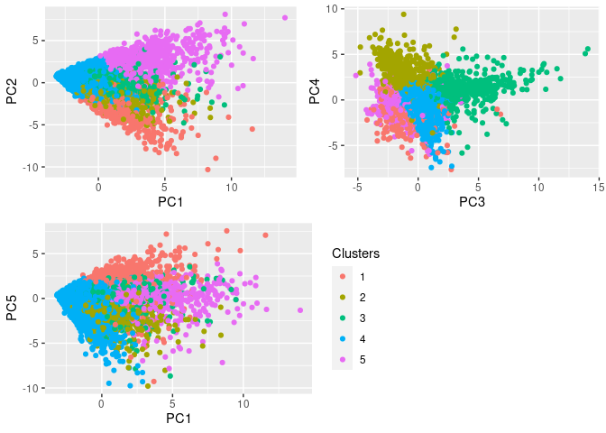
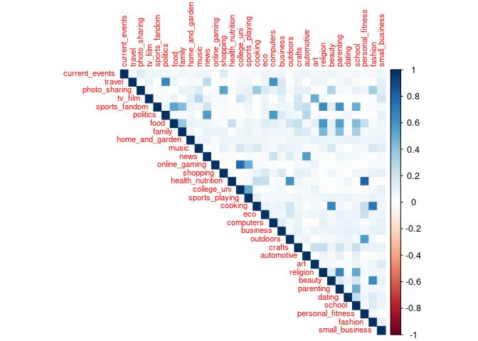

# ECO 395M: Exercises 4

# Group Members - Alina Khindanova, Anvit Sachdev, Shreya Kamble

## Problem 1: Clustering and PCA

Dataset: wine.csv

To see whether the 11 chemical propeties are capable of distinuishing
wines on the basis of their color and quality, we compute principal
component analysis (PCA) to reduce the data into small dimensions. We
also perform k-means clustering using k=2 (for colors) and k=10 (for
quality) to make the following plots.

A. Performing PCA and K-means clustering for distinguishing colors-

PCA plot:-  

k-means clustering plot:-

We can see that the k-means clustering model does a better job at
distinguishing between the red and white wines relative to PCA. This is
likely because PCA compresses the features, and k-means clustering
compresses the data points. Since, we’re focusing on similarity between
data points, so the observation is intuitive.

B. Performing PCA and K-means clustering for distinguishing quality-

PCA plot:-  

k-means clustering plot:-

Based on analysis of the above graph, it appears that neither PCA nor
k-means clustering method are effective in accurately differentiating
between wines and different quality levels as there exists very strong
overlaps across different qualitites of the wine.

We can conclude that the unsupervised algorithm used was relatively able
to distinguish between red and white wines. There are margin of errors,
but the results still could be interpreted.

Information about Dimensions and PCs:-

On an extra note, we can see below the variance percent of each
dimension (in sorted order)-

    ##       eigenvalue variance.percent cumulative.variance.percent
    ## Dim.1        3.0             27.5                        27.5
    ## Dim.2        2.5             22.7                        50.2
    ## Dim.3        1.6             14.1                        64.4
    ## Dim.4        1.0              8.8                        73.2
    ## Dim.5        0.7              6.5                        79.7
    ## Dim.6        0.6              5.5                        85.3

We can see that the six dimensions contribute to roughly 85.3% of the
variance percent.  
The information about all the PCs is given below-

    res.pca

    ## Standard deviations (1, .., p=11):
    ##  [1] 1.7406518 1.5791852 1.2475364 0.9851660 0.8484544 0.7793021 0.7232971
    ##  [8] 0.7081739 0.5805377 0.4771748 0.1811927
    ## 
    ## Rotation (n x k) = (11 x 11):
    ##                              PC1         PC2         PC3         PC4        PC5
    ## fixed.acidity        -0.23879890  0.33635454 -0.43430130  0.16434621 -0.1474804
    ## volatile.acidity     -0.38075750  0.11754972  0.30725942  0.21278489  0.1514560
    ## citric.acid           0.15238844  0.18329940 -0.59056967 -0.26430031 -0.1553487
    ## residual.sugar        0.34591993  0.32991418  0.16468843  0.16744301 -0.3533619
    ## chlorides            -0.29011259  0.31525799  0.01667910 -0.24474386  0.6143911
    ## free.sulfur.dioxide   0.43091401  0.07193260  0.13422395 -0.35727894  0.2235323
    ## total.sulfur.dioxide  0.48741806  0.08726628  0.10746230 -0.20842014  0.1581336
    ## density              -0.04493664  0.58403734  0.17560555  0.07272496 -0.3065613
    ## pH                   -0.21868644 -0.15586900  0.45532412 -0.41455110 -0.4533764
    ## sulphates            -0.29413517  0.19171577 -0.07004248 -0.64053571 -0.1365769
    ## alcohol              -0.10643712 -0.46505769 -0.26110053 -0.10680270 -0.1888920
    ##                              PC6         PC7          PC8        PC9
    ## fixed.acidity        -0.20455371 -0.28307944  0.401235645  0.3440567
    ## volatile.acidity     -0.49214307 -0.38915976 -0.087435088 -0.4969327
    ## citric.acid           0.22763380 -0.38128504 -0.293412336 -0.4026887
    ## residual.sugar       -0.23347775  0.21797554 -0.524872935  0.1080032
    ## chlorides             0.16097639 -0.04606816 -0.471516850  0.2964437
    ## free.sulfur.dioxide  -0.34005140 -0.29936325  0.207807585  0.3666563
    ## total.sulfur.dioxide -0.15127722 -0.13891032  0.128621319 -0.3206955
    ## density               0.01874307 -0.04675897  0.004831136  0.1128800
    ## pH                    0.29657890 -0.41890702 -0.028643277  0.1278367
    ## sulphates            -0.29692579  0.52534311  0.165818022 -0.2077642
    ## alcohol              -0.51837780 -0.10410343 -0.399233887  0.2518903
    ##                              PC10          PC11
    ## fixed.acidity        -0.281267685 -0.3346792663
    ## volatile.acidity      0.152176731 -0.0847718098
    ## citric.acid           0.234463340  0.0011089514
    ## residual.sugar       -0.001372773 -0.4497650778
    ## chlorides            -0.196630217 -0.0434375867
    ## free.sulfur.dioxide   0.480243340  0.0002125351
    ## total.sulfur.dioxide -0.713663486  0.0626848131
    ## density              -0.003908289  0.7151620723
    ## pH                   -0.141310977 -0.2063605036
    ## sulphates             0.045959499 -0.0772024671
    ## alcohol              -0.205053085  0.3357018784

Next, we determine how much each variable is represented in the first
two dimensions. This quality of representation is called the Cos2 and
corresponds to the square cosine. A low value of Cos2 means that the
variable is not perfectly represented by that component. A high value of
Cos2, on the other hand, means a good representation of the variable on
that component.

    fviz_cos2(res.pca, choice = "var", axes = 1:2)

## Problem 2: Market segmentation

Dataset: social\_marketing.csv

In this problem we need to analyze data and identify any interesting
market segments that appear to stand out in the social-media audience.
We deleted some rows from the dataset that do not give any value to the
analysis.

First, we explore correlations between different categories.

By looking at the correlation matrix, we can notice some patterns of the
data, and approximately define segments:

1.  The category ‘health\_nutrition’ has strong positive correlation
    with ‘personal\_fitness’, and they are both positively correlated
    with ‘outdoors’. So there are people who lead healthy lifestyle and
    spend much time outdoors.

2.  The category ‘online\_gaming’ is positively correlated with
    ‘college\_uni’, so there are university students who play online
    games.

3.  The categories ‘travel’, ‘politics’ and ‘computers’ are positively
    correlated. These people like traveling, aware of political
    situation, and discuss computers.

4.  The categories ‘fashion’, ‘beauty’ and ‘cooking’. These are people
    who are interested in fashion and beauty, they also like to discuss
    cooking.

5.  The categories ‘sports\_fandom’, ‘food’, ‘religion’ and ‘parenting’
    are positively correlated. That gives us a new segment of followers.

Next, we would like to conduct a cluster analysis. We group observations
to five clusters. Additionally, we conduct Principal Component Analysis
to define the features of our clusters according to principal
components. We will use four principal components in our analysis.

As we can see from the graphs, the first cluster has mostly positive
values of PC5. The second cluster has positive values of PC4, third
cluster has positive values of PC3, fourth cluster does not have any
features, fifth cluster has positive values of PC1 and PC2.

By looking how principal components were formed in terms of categories,
we can define four segments (they are almost the same as segment defined
by looking on correlations):

<table>
<colgroup>
<col style="width: 20%" />
<col style="width: 20%" />
<col style="width: 15%" />
<col style="width: 24%" />
<col style="width: 20%" />
</colgroup>
<thead>
<tr class="header">
<th style="text-align: left;">PC1</th>
<th style="text-align: left;">PC2</th>
<th style="text-align: left;">PC3</th>
<th style="text-align: left;">PC4</th>
<th style="text-align: left;">PC5</th>
</tr>
</thead>
<tbody>
<tr class="odd">
<td style="text-align: left;">religion</td>
<td style="text-align: left;">sports_fandom</td>
<td style="text-align: left;">politics</td>
<td style="text-align: left;">health_nutrition</td>
<td style="text-align: left;">beauty</td>
</tr>
<tr class="even">
<td style="text-align: left;">food</td>
<td style="text-align: left;">religion</td>
<td style="text-align: left;">travel</td>
<td style="text-align: left;">personal_fitness</td>
<td style="text-align: left;">fashion</td>
</tr>
<tr class="odd">
<td style="text-align: left;">parenting</td>
<td style="text-align: left;">parenting</td>
<td style="text-align: left;">computers</td>
<td style="text-align: left;">outdoors</td>
<td style="text-align: left;">cooking</td>
</tr>
<tr class="even">
<td style="text-align: left;">sports_fandom</td>
<td style="text-align: left;">food</td>
<td style="text-align: left;">news</td>
<td style="text-align: left;">politics</td>
<td style="text-align: left;">photo_sharing</td>
</tr>
<tr class="odd">
<td style="text-align: left;">school</td>
<td style="text-align: left;">school</td>
<td style="text-align: left;">automotive</td>
<td style="text-align: left;">news</td>
<td style="text-align: left;">shopping</td>
</tr>
</tbody>
</table>

1.  There is a segment interested in religion, food, parenting and
    sports.

2.  There is a segment interested in healthy lifestyle: health
    nutrition, personal fitness and outdoor activities.

3.  There is a segment interested in politics, traveling and computers.

4.  There is a segment interested in beauty, fashion and cooking.

## Problem 3: Association rules for grocery purchases

Dataset: groceries.txt

We take a look at the dimensions of this data:

    ## [1] 9835  169

This means we have 9835 transactions and 169 distinct items.  
The top 10 most items in terms of abosolute frequencies are:-  

The top 10 most items in terms of relative frequencies are:-  

The next step is to analyze the rules using the A-Priori Algorithm. We
picked the thresholds of support as 0.005, confidence as 0.1 and lift
as 1. We chose the support threshold as 0.005 as we wanted to capture
rules of only those items that have popularity of at least 0.5%. We
chose the threshold of confidence as 0.1 as we are interested in only
those (X,Y) pairs such that the Prob(Y|X) is at least 10%. We chose lift
threshold to be 1 as it is the traditional threshold that implies which
implies that item Y is likely to be bought if item X is bought.

Now we plot all the rules in (support, confidence) space.  
%20space-1.png)

We can notice from the above graph that the high lift rules tend to have
low support.  
Similarly, we plot all the rules in (support, lift) space.  
%20space-1.png)

The top 10 rules based on the confidence are-

    ##      lhs                     rhs                    support confidence    coverage     lift count
    ## [1]  {root vegetables,                                                                           
    ##       tropical fruit,                                                                            
    ##       yogurt}             => {whole milk}       0.005693950  0.7000000 0.008134215 2.739554    56
    ## [2]  {other vegetables,                                                                          
    ##       pip fruit,                                                                                 
    ##       root vegetables}    => {whole milk}       0.005490595  0.6750000 0.008134215 2.641713    54
    ## [3]  {butter,                                                                                    
    ##       whipped/sour cream} => {whole milk}       0.006710727  0.6600000 0.010167768 2.583008    66
    ## [4]  {pip fruit,                                                                                 
    ##       whipped/sour cream} => {whole milk}       0.005998983  0.6483516 0.009252669 2.537421    59
    ## [5]  {butter,                                                                                    
    ##       yogurt}             => {whole milk}       0.009354347  0.6388889 0.014641586 2.500387    92
    ## [6]  {butter,                                                                                    
    ##       root vegetables}    => {whole milk}       0.008235892  0.6377953 0.012913066 2.496107    81
    ## [7]  {curd,                                                                                      
    ##       tropical fruit}     => {whole milk}       0.006507372  0.6336634 0.010269446 2.479936    64
    ## [8]  {citrus fruit,                                                                              
    ##       root vegetables,                                                                           
    ##       whole milk}         => {other vegetables} 0.005795628  0.6333333 0.009150991 3.273165    57
    ## [9]  {other vegetables,                                                                          
    ##       pip fruit,                                                                                 
    ##       yogurt}             => {whole milk}       0.005083884  0.6250000 0.008134215 2.446031    50
    ## [10] {domestic eggs,                                                                             
    ##       pip fruit}          => {whole milk}       0.005388917  0.6235294 0.008642603 2.440275    53

We graphically visualize the top 10 rules by the following graphs-  

We can see from the above plots that fruits, vegetables and dairy
products are the most common grocery items. We can see that if a person
bought fruits, vegetables and dairy products; it is very likely for us
to see them adding whole milk in his/her basket as well. We can also see
that if a person bought citrus fruit, root vegetables, and whole milk;
it is very likely for us to see them adding other vegetables in his/her
basket as well.  
The above discoveries make perfect sense as these are very common
grocery items and this behavior is often observed in the grocery stores.
